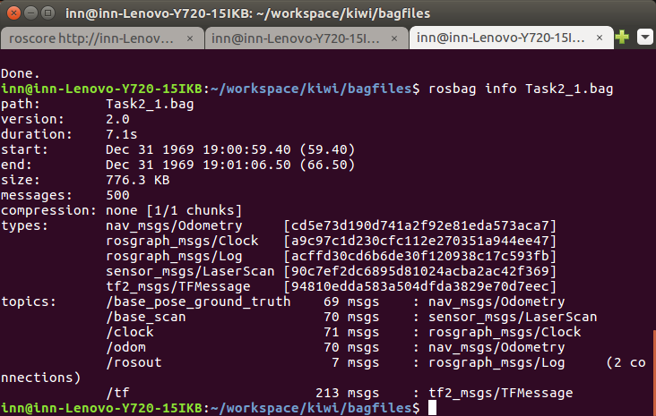
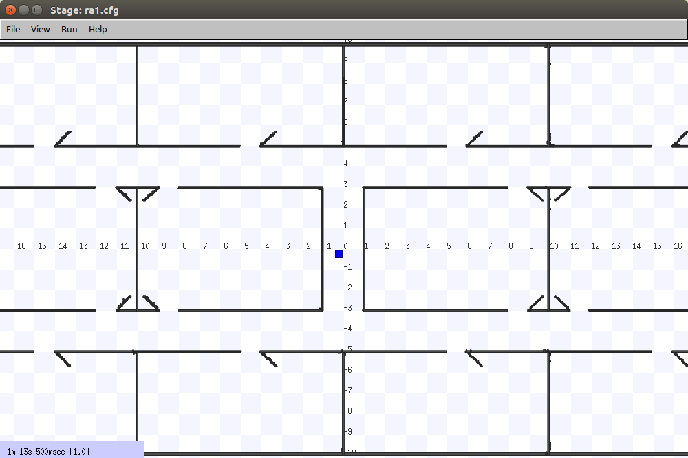
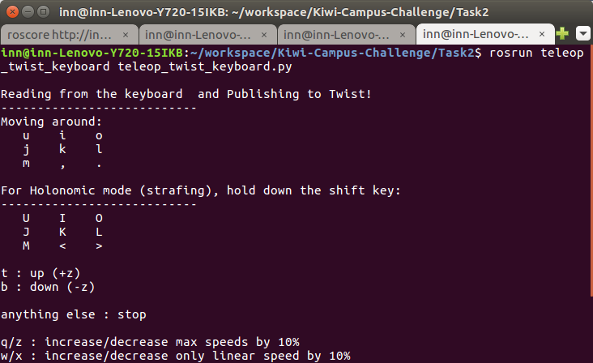

# Task 2: Stage Mobile Robot Simulator

## Task 2.1

The configuration file and map are defined and the simulator is launched using the command as follows:

```
rosrun stage_ros stageros ra1.cfg
```

A bag file called Task2_1.bag is created storing all topics.


```
rosbag record -a
```



## Task 2.2
The simulated robot can be controlled using the script teleop_twist_keyboard.py from the teleop_twist_keyboard package.



```
rosrun teleop_twist_keyboard teleop_twist_keyboard.py
```



A bag file is created while controlling the robot of name Task2_2.bag