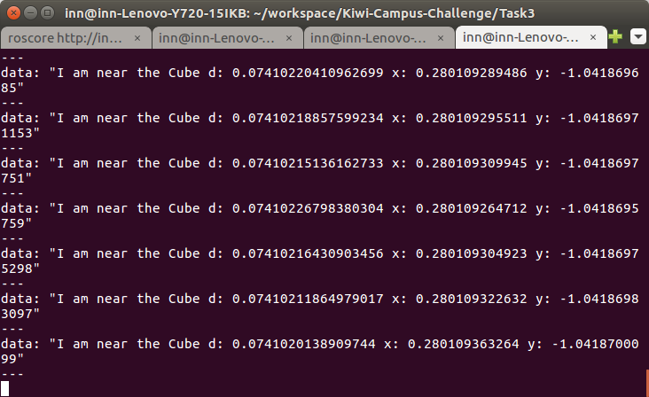
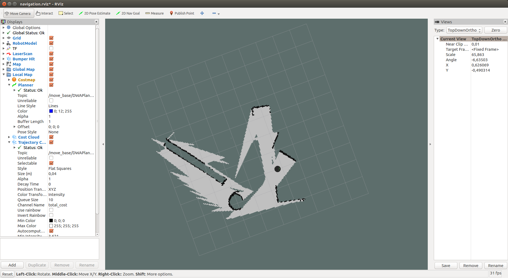

# Task 3: Turtlebot 

## Task 3.1

The Turtlebot along with a world with defined obstacles is simulated in Gazebo. It is also manually controlled using the keyboard_teleop.launch.

```
roslaunch turtlebot_gazebo turtlebot_world.launch
roslaunch turtlebot_teleop keyboard_teleop.launch
```


A bag file called Task3_1.bag is created storing just the topics associated with the motion since the images from the camara and other sensors create too much information that is not necessary at this point, but all the topics can be seen in the following image.


## Task 3.2
The Real Time Factor is the ratio that tells me how close is my simulation to run in real time. A RTF of 1.0 indicates that the simulation is in deed running in real time. 

## Task 3.3

A catkin package named location_monitor is created subscribe to the Odometry information and publish to a topic named location_monitor_log when the turtlebot is within the defined circles. The script can be found in this folder as location_monitor_node.py.



The bag file Task3_3.bag is created only with the topics related to the motion and the location_monitor_log topic to check out the log.

## Task 3.4
SLAM is performed using the gmaping tool and is visualized using RVIZ.

```
roslaunch turtlebot_gazebo gmapping_demo.launch
roslaunch turtlebot_rviz_launchers view_navigation.launch
```

The mapping can be reproduced using the bag file Task3_4.bag and looks as follows.

